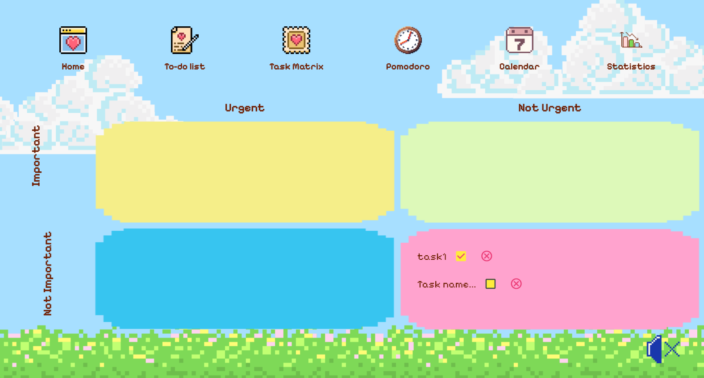
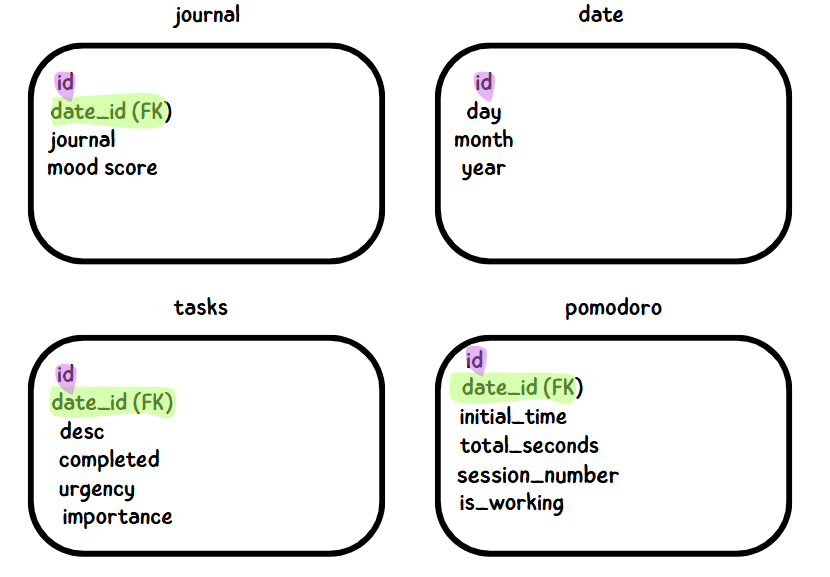
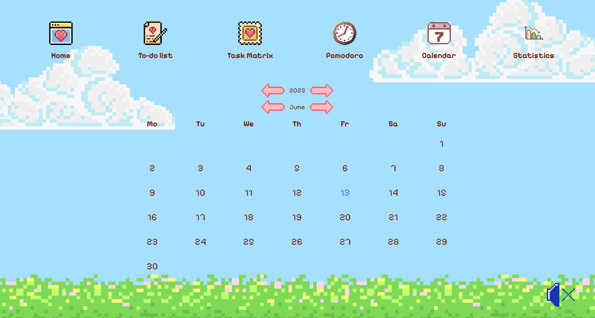
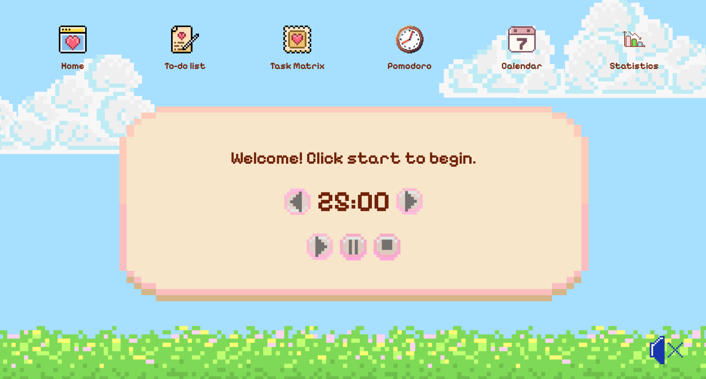
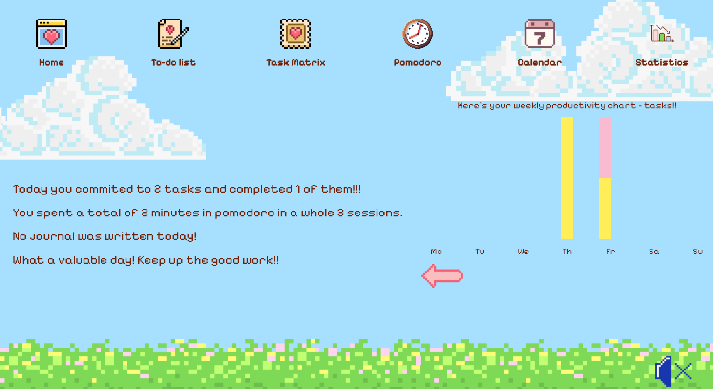

# ✨🎀 COSY PLANNER ✨🎀  

## A project to help you thrive! 🌱🧠  
With Cosy Planner, you can:  
* ⏱️ Manage your time  
* 📈 Track your progress  
* 👁️ Focus better with cheerful pixel beats 🎶  
* 📠 Get more things done  
* 😃 Become happier and 😎 more confident!

---

## 🧰 Technologies We Used 🤖  
* 🐍 Python with the **Flet** framework 🪈  
* 🗂️ **SQLite3** database 🗃️

---

## 💻 Our Program Includes:

### 📋 To-Do List + Eisenhower Matrix  
  

---

### 🧮 Database  
  
Uses **SQLite3** to manage your data — save, remove, or update journals and tasks as you wish.

---

### 📅 Calendar  
In the calendar, you can:  
* 🖋️ Write in your journal  
* 😃 Click to record your mood 😡  

---

### 🧠 AI-Powered Affirmations 🤖  
Generates **positive affirmations** tailored just for you!

---

### 🍅 Pomodoro Timer  
Boost your **focus** 👁️ and **productivity** 🧠 using the Pomodoro technique!

---

### 📈 Statistics 
Track your **progress** 📊 using the inbuilt **statistics tab**📈 !

### 🖼️ Built with Flet  
We used the **Flet framework** to create graphics and UI elements.  

> ⚠️ Don’t forget to create your own `.env` file with your unique `OPENAI_API_KEY` to enable AI features!
